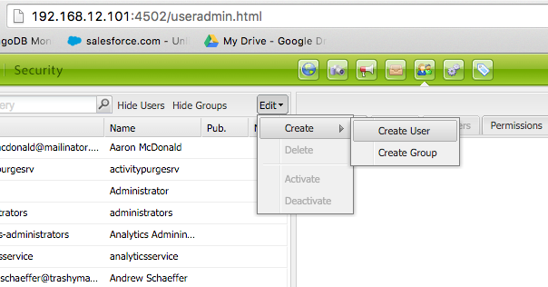
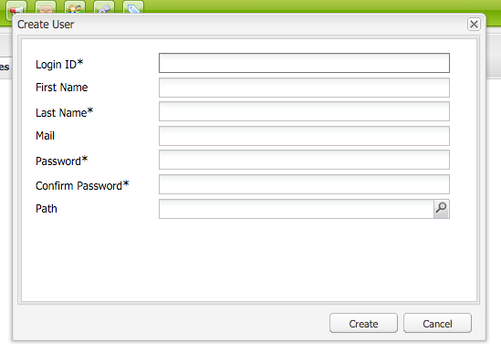
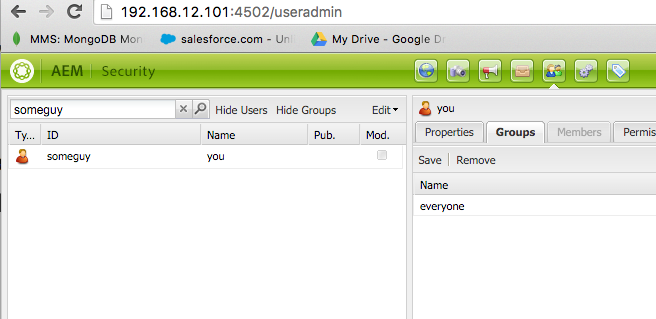

s
# Chapter 2
Over the lessons of this chapter we will be focussing on the following aspects
- Understand the different data formats that AEM stores in MongoDB
- Internal data structure
- Introduction to MongoDB
- How to configure MongoDB
- How to boot AEM instances to MongoDB

## Chapter handout structure
For this chapter handout we are going to assume that you have completed chapter 1 and that you should drop this folder

- mongodb instance: virtual machine that where we will be installing a standalone MongoDB instance
- aem instance: here we will be installing the AEM and connecting that to MongoDB instance

Do not forget that for a correct installation and operation of *aem* instances you need to have a copy and license of your AEM 6.0 or 6.1 in the _AEM/author_ folder


## Instruction Set
We are going to use in this lesson a single MongoDB standalone instance and use that to support a standalone AEM instance
The following block of instructions describe the steps necessary to get the system up and running.

### Boot MongoDB Environment
Raise one virtual machine dedicated to MongoDB standalone instance
```bash
cd chapter2/MongoDB
vagrant up
```
Verify instance status
```bash
vagrant status mongod
```
### Launch MongoDB Instance
Now that we have an running vm dedicated to MongoDB is time to setup the instance

Let's check if `mongod` is properly installed
```bash
cd chapter2/MongoDB
vagrant ssh mongod
mongod -version
```
Let's boot up `mongod`
```bash
mongod --dbpath data --storageEngine wiredTiger --logpath data/log --fork
```
Alternatively you can also run the following command:
```bash
mongod -f mongod.conf
```
We recommend you to proceed with the first command so you can get a better understanding of different options we are setting MongoDB with.

### Install AEM software on local author folder
To boot the AEM environment and to have a correct installation you need to copy your version of AEM and place it under the following folder:
```bash
cp YOUR_AEM_VERSION_JAR AEM/author/cq-author-p4502.jar
```

### Boot AEM Environments
On this chapter we will be launching 2 virtual machines for 2 different AEM instances
```bash
cd chapter2/AEM
vagrant up aem1
vagrant up aem2
```
Verify that we will have 2 VMs
```bash
vagrant status
```

### Launch AEM Instances
Once we have an environment for our AEM installation, its time to launch our `author` instance

```bash
vagrant ssh aem1
#let's create a screen
screen -a
java -Xmx2g -XX:MaxPermSize=512m -jar /vagrant/cq-author-p4502.jar -r crx3,crx3mongo -Doak.mongo.uri="mongodb://192.168.12.100:27017"
```
To detach from the loaded screen just press ctrl+a+d

Same operation for the second instance
```bash
vagrant ssh aem2
#let's create a screen
screen -a
java -Xmx2g -XX:MaxPermSize=512m -jar /vagrant/cq-author-p4502.jar -r crx3,crx3mongo -Doak.mongo.uri="mongodb://192.168.12.100:27017"
```

### Stop Instances
Make sure to stop the vagrant VM's after you finished the exercises.
```bash
cd MongoDB
vagrant halt
cd ../AEM
vagrant halt
```

## AEM Instructions

### Create Users
Over the exercises for this chapter creation of different users will be required.
To accomplish this you should perform the following steps
- connect to the admin users menu: [http://192.168.12.101:4502/useradmin.html](http://192.168.12.101:4502/useradmin.html)
- Got to: Edit -> Create -> Create User



- And then fill in the required information:




### Add User to Group
For our users to be able to accomplish some tasks they need to belong to groups. By default they are added to the __everyone__ group but you might be required to add the user to other groups.
The following instructions will enable that:
- Select an User and the *Groups* tab:




## Potential Issues
Dealing with homebrewed virtual machines can sometimes lead to unexpected situations.

Some these issues may lead to incorrect boot up of the AEM or MongoDB instances.

The following are just a few of these issues that where captured during the making of these exercises that might happen to be seen.

### Sticky `/tmp/mongodb-27017.sock` Files
If you happen to `halt` or shutdown your laptop without using `vagrant destroy` command the VMs will be able to reboot correctly but they can leave behind temporary files that lock sockets.
These files may provoke that you might be able to connect to the running `mongod` instance but connections from outside that VM won't be possible, causing AEM instances to stop the normal loading and leading to requests being rejected with something similar to the following message:
```
HTTP 503
AuthenticationSupport service missing. Cannot authenticate request
```
If that happens follow this procedure:
- connect to the MongoDB VM
- stop `mongod` process
```
mongo admin --eval 'db.shutdownServer()'
```
- remove the `/tmp/mongodb-27017.sock` file
```
rm -rf /tmp/mongodb-27017.sock
```
- relaunch `mongod` process
